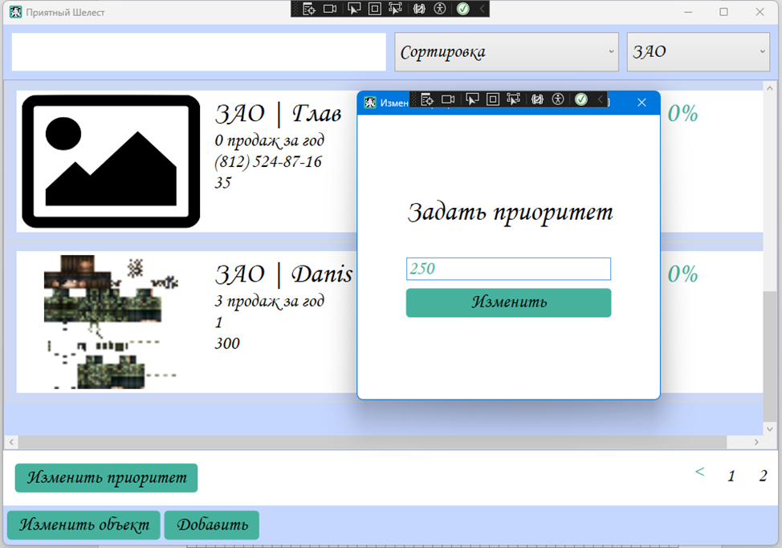
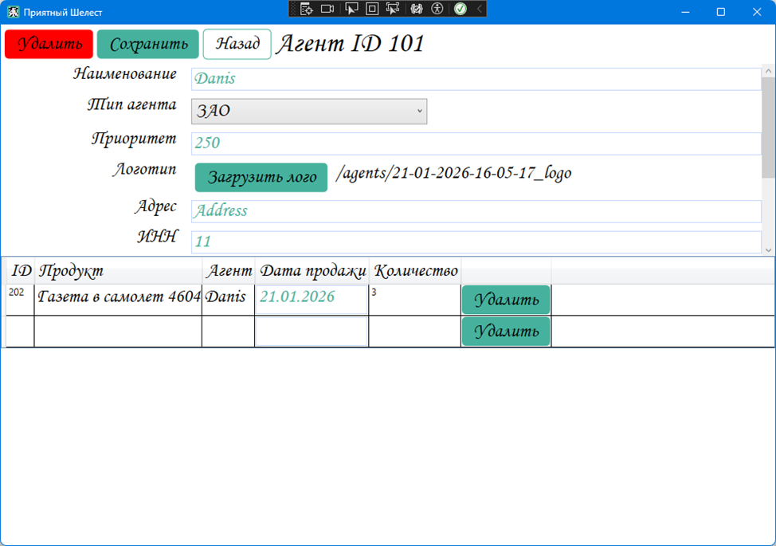

# Дияров Данис 2023 демоэкзамен - Система учёта агентов "Приятный Шелест"

Описание проекта: настольное приложение под Windows для просмотра, добавления, изменения, удаления агентов и табличных данных, связанных с ними.

.NET Framework 4.7.1, Entity Framework, WPF, Sql Server

### Начало работы

Эти инструкции предоставят вам копию проекта и помогут запустить на вашем локальном компьютере для разработки и тестирования.

### Необходимые условия

1. ОС Windows
2. Установлен .NET Framework
3. Скопированный репозиторий из GitHub
4. Доступ к MSSQL на localhost (можно в Docker - для этого есть файл docker-compose.yaml)

### Что нужно для установки программного обеспечения и как его установить

1. **Этот репозиторий** - скачать папку как архив или с помощью git (скачать с офиц. сайта программу **Git** для Windows)
2. **Docker** для быстрого развёртывания MSSQL - скачать с офиц. сайта **Docker Desktop**

### Установка

Пошаговая серия примеров, которые говорят, что вы должны запустить

Рассмотрим задуманный путь установки - с git и Docker:

1. Предположим, вы установили **Docker Desktop** и **Git**
2. Выполните команды:
```
cd /Путь/куда/скачать/программу

git clone https://github.com/chempik1234/-college-01-01-V3

cd -college-01-01-V1

docker compose up -d

dotnet build -c Release
```
3. Перейдите в проводник в эту самую директорию. Перейдите в `SP2023UserDanisV32 -> bin -> Release`
4. Запустите программу (.exe файл)
5. Если программа не запускается из-за отсутствия Runtime .NET или чего-либо ещё, связанного с выполнением, отправляйтесь в поисковую систему и установите то, что требуется




## Авторы

1. *Данис Дияров* - https://github.com/chempik1234
